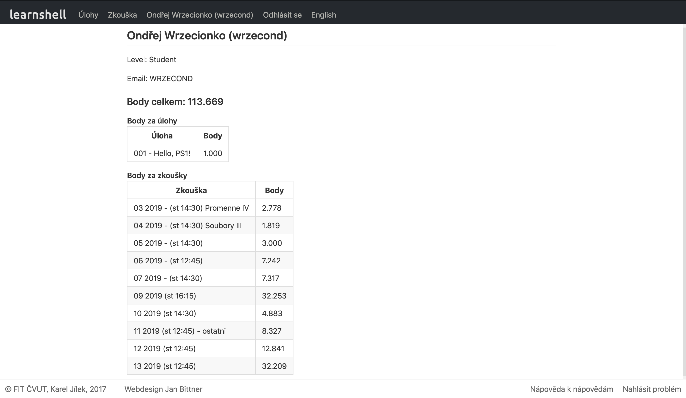

= Programming in shell 1

Got more than 100 % thanks to being faultless from 5th week.

== Tests

The following table describes how many points could be earned from each test. "Max" refers to maximum points earned without time bonus.

|===
|Week |Points |Max |Note

|3|2.778|3|-
|4|1.819|3|-
|5|3|3|-
|6|7.242|6|-
|7|7.317|6|-
|8|-|-|No lab & test
|9|32.253|30|Big test #1
|10|4.883|4|-
|11|8.327|8|-
|12|12.841|12|-
|13|32.209|30|Big test #2

|*Total*|*113.669*|*105*|-

|===

== Notes

Various notes taken throughout the lectures and labs